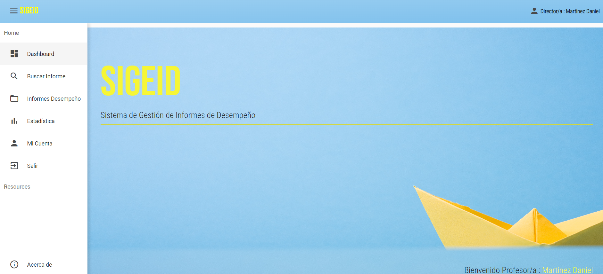

# SIGEID

## Descripción

**SIGEID** (Sistema de Gestión de Informes de Desempeño) es una aplicación desarrollada para la educación secundaria de la provincia de Santa Cruz, Argentina. Este sistema está diseñado para generar informes de desempeño de los estudiantes, facilitando a los docentes la creación de los informes y proporcionando estadísticas valiosas para el equipo directivo.

## Funcionalidades Principales

- **Generación de Informes de Desempeño:** Permite a los docentes crear informes detallados sobre el desempeño de los estudiantes de manera eficiente y estandarizada.
- **Estadísticas y Análisis:** Genera estadísticas y análisis detallados que permiten al equipo directivo tomar decisiones informadas sobre el rendimiento académico.
- **Interfaz Intuitiva:** Diseñada para ser fácil de usar, permitiendo a los usuarios navegar y utilizar el sistema sin dificultad.
- **Seguridad y Privacidad:** Asegura que la información de los estudiantes y los informes sean manejados con estricta confidencialidad y seguridad.

## Objetivos

- Simplificar y estandarizar el proceso de creación de informes de desempeño para los docentes.
- Proveer herramientas de análisis y estadísticas que ayuden al equipo directivo a mejorar la calidad educativa.
- Mejorar la eficiencia administrativa en la gestión de información académica.

## Beneficiarios

- **Docentes:** Facilita la creación y gestión de informes de desempeño.
- **Estudiantes:** Reciben retroalimentación detallada y constructiva sobre su desempeño.
- **Equipo Directivo:** Obtienen estadísticas y análisis precisos para mejorar la toma de decisiones y la calidad educativa.

## Tecnologías Utilizadas

- **Frontend:** Angular
- **Backend:** Spring Boot
- **Base de Datos:** MySQL
- **DevOps:** Docker

